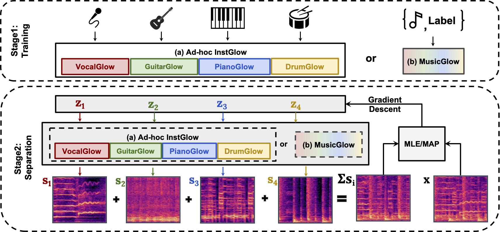

# Generative Source Separation using Glow
Source separation as an inverse problem. Open source code for the paper 'Music Source Separation with Generative Flow' [arxiv](https://arxiv.org/abs/2204.09079). Demo page is [here](https://airlabur.github.io/gss/).

## Introduction
Music source separation with both paired mixed signals and source signals has obtained substantial progress over the years. However, this setting highly relies on large amounts of paired data. Source-only supervision decouples the process of learning a mapping from a mixture to particular sources into a two stage paradigm: source modeling and separation. In this project, we leverage flow-based implicit generators to train music source priors and likelihood based objective to separate music mixtures.

## requirements
pytorch>=1.5.0\
tqdm\
librosa\
jupyter\
museval\
tqdm\
pandas\
[apex](https://github.com/NVIDIA/apex)

## Usage
Download our pretrained [checkpoints](https://drive.google.com/file/d/16_L8-f1mYZ7oHnoxDpVTjAEpDHeBEb2y/view?usp=sharing), then run inference on any audio files.
    
### Inference
There are two examples in `inference_demo.ipynb`, you can also preview these samples in the `Bonus tracks` from the [demo](https://airlabur.github.io/gss/) page. You can also try your own music mixture wav files. In our framework, it's able to process relatively long audio segments (even over 1 minute).

## Experimental Results on MusDB
| Method     |Supervision|Backbone   | Vocals  | Bass     |Drums     | Other    |
|:------------:|:-----------:|:-----------:|:----------:|:----------:|:----------:|:----------:|
| Demucs(v2) | Full| U-Network |7.14      |5.50      |6.74      |4.16      |
| Conv-TasNet|Full|TCN        |7.00      |4.19      |5.25      |3.94      |
| Open Unmix |Full|BiLSTM     |6.86      |4.88      |6.35      |3.86      |
| Wave-U-Net  | Full|U-Network |5.06      |2.63      |3.74      |1.95      |
| **InstGlow(Ours)**   |Source-only|Glow       |3.92      |2.58      |3.85      |2.37      |
| GAN-Prior   |Source-only|SpecGAN       |-0.44    |0.48  |-0.40      |0.32      |

## Experimental Results on Slakh2100-submix
| Method     |Supervision|Backbone   | Bass*     |Drums*    | Guitar | Piano    |
|:------------:|:-----------:|:-----------:|:---------:|:--------:|:---------:|:---------:|
| Demucs(v2) | Full| U-Network |5.48      |10.21      |-     |-     |
| Conv-TasNet|Full|TCN        |4.97      |9.95      |-     |-     |
| Open Unmix |Full|BiLSTM     |4.66    |8.64      |-      |-     |
| Wave-U-Net  | Full|U-Network |0.01      |3.91     |-     |-     |
| **InstGlow(Ours)**   |Source-only|Glow       |1.54      |6.14      |1.85      |0.80      |
| GAN-Prior   |Source-only|SpecGAN       |0.09      |0.85      |-0.01     |-0.42      |

## References
[GlowTTS](https://github.com/jaywalnut310/glow-tts)

